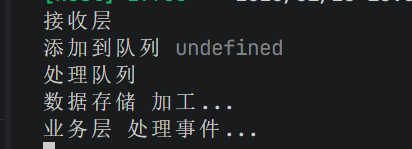

# 埋点监控后端

这是一个基于NestJS的埋点监控系统，用于收集、存储和分析应用程序的埋点数据。

## 项目架构

项目采用分层架构，将系统分为以下四个层次：

- 接收层：处理前端应用程序的埋点数据。
- 处理层：对埋点数据进行收集、转换和存储。
- 业务层：包含业务逻辑，如分析和报告。
- 存储层：负责将处理后的数据存储到数据库中。

src模块介绍：

- gateway目录：处理与前端应用程序的实时通信。
- processing目录：处理埋点数据的收集、转换和存储。
- business目录：包含业务逻辑，如分析和报告。
- queue目录：处理异步任务，如数据存储。
- storage目录：负责将处理后的数据存储到数据库中。

系统脉络：
我举一个例子 比如前端发送埋点数据上来

1. 数据到接收层 getway
2. 接收层将数据推送到队列（可能后期要对应用户）
3. 队列层将数据取出，调用处理层
4. 处理层将数据转换为业务模型，调用业务层
5. 实现对应业务逻辑 调用存储层
6. 存储层将数据存储到数据库中（这一块还没有写）

## 怎么启动

1. 安装依赖：`pnpm i`
2. 启动项目：`pnpm start`

## 技术栈

- 后端：NestJS
- 数据库：MySQL
